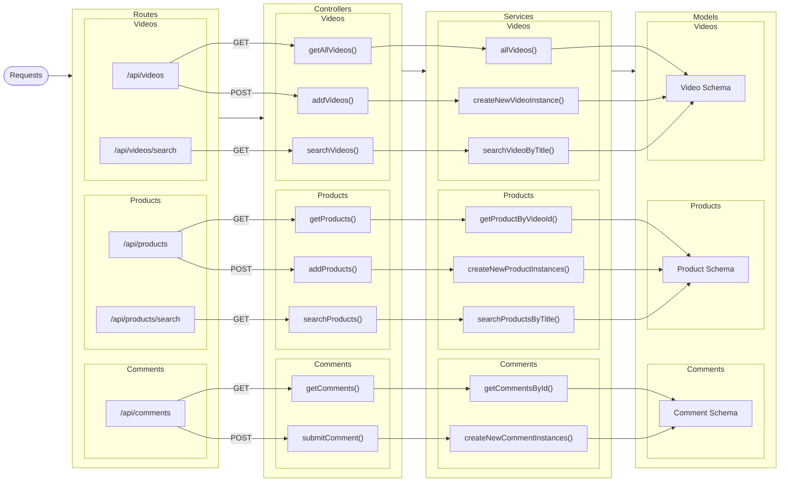

# Mid Term Project (Backend Only)

# Getting Started

Clone the repo:

```bash
git clone https://github.com/FullStack-Homework/Midterm.git
```

then run:

```bash
npm install
```

or with pnpm:

```bash
pnpm install
```

Run the development server:

```bash
npm run dev
```

or

```bash
pnpm dev
```

Then the server will run on port 3000 as default

## Environment Variables

`DB_URL = your mongodb url`

# Database structure

### Comments Collection

```
[
  {
    "id": <Mongodb ObjectId>,
    "comment": string
    "videoId": <Mongodb ObjectId>
    "username": string
    "timestamp": datetime(iso 8601)
  }
]
```

### Products Collection

```
[
  {
    "id": <Mongodb ObjectId>,
    "title": string
    "urlProduct": string
    "price": number
    "videoId": <Mongodb ObjectId>
  }
]
```

### Videos Collection

```
[
  {
    "id": <Mongodb ObjectId>,
    "title": string,
    "url": string,
  }
]
```

# API Structure



##

# API Responses and Requests

## Comments

- Comment object
  ```
  {
    id: string,
    comment: string,
    videoId: string,
    username: string,
    timestamp: datetime(iso 8601)
  }
  ```

#### Get /api/comments

Returns all comments for particular video

- **URL Params**
  None
- **Data Params**

  - **Body:**
    ```
    {
      videoId: string
    }
    ```

- **Headers**
  Content-Type: application/json
- **Success Response:**
  - **Code:** 200
  - **Content:**
    ```
    [
      {
        "status": "Success",
        "data": [{<comment object>}]
      }
    ]
    ```
- **Error Response:**
  - **Code:** 400
  - **Content:**
    ```
    {
      "status": "Failed",
      "message": "Video ID is required"
    }
    ```
    or
  - **Code:** 404
  - **Content:**
    ```
    {
      "status": "Failed",
      "message": "Video not found"
    }
    ```

#### Post /api/comments

Adds a new comment to a video

- **URL Params**
  None
- **Data Params**

  - **Body:**
    ```
    {
      videoId: string,
      comment: string,
      username: string
    }
    ```

- **Headers**
  Content-Type: application/json
- **Success Response:**
  - **Code:** 200
  - **Content:** `{ status: 'Success'}`
- **Error Response:**

  - **Code:** 400
  - **Content:**

    ```
    {
      status: "Failed" ,
      message: "Missing required attributes"
    }
    ```

    or

  - **Code:** 404
  - **Content:**
    ```
    {
      status: "Failed",
      message: "Video not found"
    }
    ```

## Products

- Product object
  ```
  {
    id: string,
    title: string,
    urlProduct: string,
    price: number,
    videoId: string
  }
  ```

#### Get /api/products

Returns all products for particular video

- **URL Params**
  None
- **Data Params**

  - **Body:**
    ```
    {
      videoId: string
    }
    ```

- **Headers**
  Content-Type: application/json
- **Success Response:**
  - **Code:** 200
  - **Content:**
    ```
    [
      {
        "status": "Success",
        "data": [{<product object>}]
      }
    ]
    ```
- **Error Response:**
  - **Code:** 400
  - **Content:**
    ```
    {
      "status": "Failed",
      "message": "Video ID is required"
    }
    ```
    or
  - **Code:** 404
  - **Content:**
    ```
    {
      "status": "Failed",
      "message": "Video not found"
    }
    ```

#### Get /api/products/search

Returns products that contain query parameter in their title

- **URL Params**
  - **Query Params:**
    ```
    {
      title: string
    }
    ```
- **Data Params**
  None
- **Headers**
  Content-Type: application/json
- **Success Response:**
  - **Code:** 200
  - **Content:**
    ```
      {
        "status": "Success",
        "data": [{<product object>}]
      }
    ```
- **Error Response:**
  - **Code:** 400
  - **Content:**
    ```
    {
      "status": "Failed",
      "message": "Title is required"
    }
    ```

#### Post /api/products

Adds a new product to a video

- **URL Params**
  None
- **Data Params**

  - **Body:**
    ```
    {
      videoId: string,
      title: string,
      urlProduct: string,
      price: number
    }
    ```

- **Headers**
  Content-Type: application/json
- **Success Response:**
  - **Code:** 201
  - **Content:**
    ```
    {
      "status": "Success",
    }
    ```
- **Error Response:**
  - **Code:** 400
  - **Content:**
    ```
    {
      "status": "Failed",
      "message": "Video ID is required"
    }
    ```
    or
  - **Code:** 404
  - **Content:**
    ```
    {
      "status": "Failed",
      "message": "Video not found"
    }
    ```

## Videos

- Video object

  ```
  {
  id: string,
  title: string,
  url: string
  }
  ```

#### Get /api/videos

Returns all videos

- **URL Params**
  None
- **Data Params**
  None
- **Headers**
  Content-Type: application/json
- **Success Response:**
  - **Code:** 200
  - **Content:**
    ```
    {
      "status": "Success",
      "data": [{<video object>}]
    }
    ```

#### Get /api/videos/search

Returns videos that contain query parameter in their title

- **URL Params**
  - **Query Params:**
    ```
    {
      title: string
    }
    ```
- **Data Params**
  None
- **Headers**
  Content-Type: application/json
- **Success Response:**
  - **Code:** 200
  - **Content:**
    ```
    {
      "status": "Success",
      "data": [{<video object>}]
    }
    ```
- **Error Response:**
  - **Code:** 400
  - **Content:**
    ```
    {
      "status": "Failed",
      "message": "Title is required"
    }
    ```

#### Post /api/videos

Adds a new video to a video

- **URL Params**
  None
- **Data Params**

  - **Body:**
    ```
    {
      title: string,
      url: string
    }
    ```

- **Headers**
  Content-Type: application/json
- **Success Response:**
  - **Code:** 201
  - **Content:**
    ```
    {
      "status": "Success",
    }
    ```
- **Error Response:**
  - **Code:** 400
  - **Content:**
    ```
    {
      "status": "Failed",
      "message": "Missing required attributes"
    }
    ```
